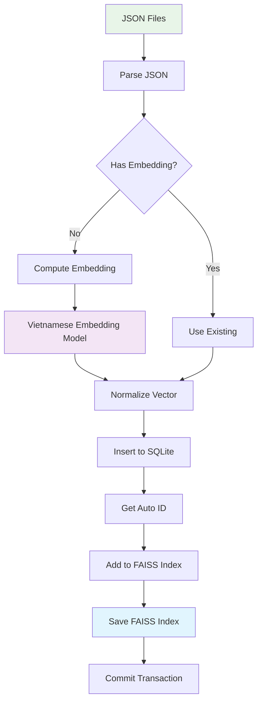
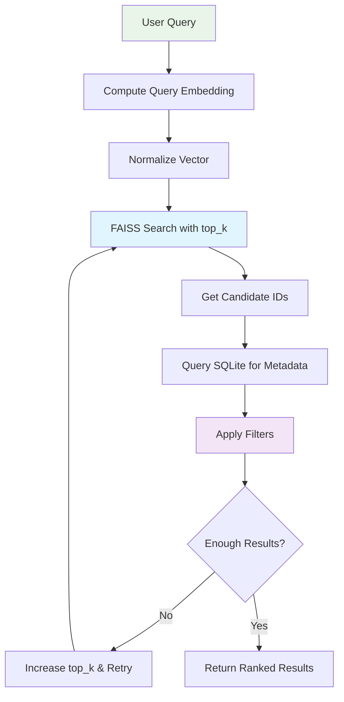
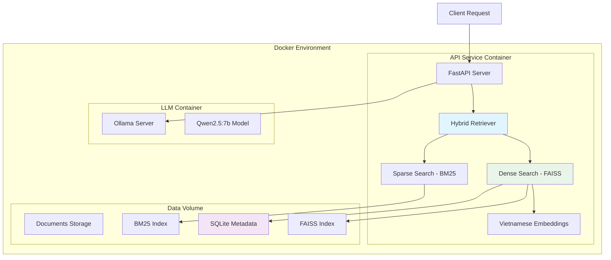

Tôi sẽ thiết kế tài liệu triển khai FAISS dựa trên yêu cầu và dàn ý của bạn:

## Tài liệu Triển khai FAISS cho Hệ thống RAG Tiếng Việt

### A. Lựa chọn Triển khai FAISS

#### Mục tiêu

- Tốc độ truy vấn nhanh cho 100-1000 tài liệu A4 tiếng Việt
- Hỗ trợ filtering theo metadata (is_active, invalidated_by, access_roles)
- Dễ audit và có thể chạy trên GPU/CPU
- Tích hợp với Hybrid Retriever trong Docker environment

#### 1. Lựa chọn Index: IndexFlatIP + IndexIDMap2

**Quyết định:** Sử dụng `IndexFlatIP` kết hợp với `IndexIDMap2`

**Ưu điểm:**

- **Exact search:** Không mất độ chính xác như approximate methods
- **Hiệu suất cao:** Cực nhanh cho corpus vài nghìn vectors
- **Đơn giản:** Dễ implement và maintain
- **Cosine similarity:** Khi normalize vectors, inner product ≈ cosine similarity
- **Custom ID mapping:** IndexIDMap2 cho phép gán ID tùy chỉnh thay vì sequential

**So sánh với các lựa chọn khác:**

- **IndexHNSWFlat:** Approximate, phức tạp hơn, không cần thiết cho corpus nhỏ
- **IVF/PQ:** Dành cho hàng trăm nghìn+ vectors, quá phức tạp cho use case này

#### 2. GPU Support

**Quyết định:** Sử dụng `faiss-gpu` để tối ưu hiệu suất

**Implementation:**

```python
import faiss
import faiss.contrib.torch_utils

# Khởi tạo với GPU nếu có
if faiss.get_num_gpus() > 0:
    res = faiss.StandardGpuResources()
    index = faiss.GpuIndexFlatIP(res, dimension)
else:
    index = faiss.IndexFlatIP(dimension)
    
# Wrap với IndexIDMap2 để custom ID
index = faiss.IndexIDMap2(index)
```
đầu vào là file json có cấu trúc như SAU
```json
{
  "document_id": "baomoi",
  "title": "baomoi.docx",
  "source": "rag_system\\data\\raw_documents\\baomoi.docx",
  "version": "1.0",
  "language": "vi",
  "last_updated": "2025-08-14T20:48:05.556744",
  "model_name": "AITeamVN/Vietnamese_Embedding",
  "embedding_dim": 1024,
  "chunks": [
    {
      "chunk_id": "baomoi-000",
      "document_id": "baomoi",
      "text": "Theo Bộ_trưởng , Chủ_nhiệm Văn_phòng Chính_phủ Trần_Văn_Sơn , , một mốc son chói",
      "embedding": [
        0.054163843393325806,
        -0.005651718471199274,
        -0.013429240323603153,
        -0.020504608750343323,
        -0.06650938838720322,
        ..................
        0.013361732475459576,
        0.04575640335679054,
        0.05632421001791954
      ]
    },
    {
      "chunk_id": "baomoi-001",
      "document_id": "baomoi",
      "text": "n chính_trị đặc_biệt quan_trọng , một mốc son chói_lọi trong lịch_sử dựng nước và giữ nước vẻ_vang của dân_tộc .",
      "embedding": [
        0.04647316038608551,
        0.05858635902404785,
        -0.005312374327331781,
        -0.004869976546615362,
        -0.055631622672080994,
		..............
        0.037987735122442245,
        0.00979478470981121,
        -0.0024369689635932446
      ]
    }
  ]
}
```

#### 3. Persistence Strategy

**Vấn đề Persistence:**

- FAISS index cần được lưu trữ persistent để tránh rebuild mỗi lần restart
- Metadata cần đồng bộ với FAISS index
- Cần strategy cho backup và recovery

**Giải pháp:**

- **FAISS Index:** Lưu bằng `faiss.write_index(index, path)`
- **Metadata:** Lưu trong SQLite với ACID properties
- **Consistency:** Sử dụng transactional operations

### B. Metadata Store & Soft-Delete Schema

#### 1. Lựa chọn Storage: SQLite

**Lý do chọn SQLite:**

- **ACID compliance:** Đảm bảo data consistency
- **Portable:** Single file, dễ backup và migrate
- **Performance:** Đủ nhanh cho corpus nhỏ/vừa
- **Zero configuration:** Không cần setup database server
- **SQL standard:** Dễ query và maintain

#### 2. Database Schema

```sql
-- Bảng chính lưu chunks
CREATE TABLE IF NOT EXISTS chunks (
    id INTEGER PRIMARY KEY AUTOINCREMENT,       -- FAISS ID
    chunk_id TEXT UNIQUE NOT NULL,              -- "lythaito-000"
    document_id TEXT NOT NULL,                  -- "lythaito"
    title TEXT,                                 -- "lythaito.docx"
    source TEXT,                                -- file path
    version TEXT DEFAULT "1.0",                -- document version
    language TEXT DEFAULT "vi",                -- language code
    text TEXT NOT NULL,                         -- chunk content
    tokens INTEGER,                             -- token count
    heading TEXT,                               -- section heading
    heading_level INTEGER DEFAULT 1,           -- heading hierarchy
    section_index INTEGER DEFAULT 0,           -- section position
    section_chunk_index INTEGER DEFAULT 0,     -- chunk position in section
    
    -- Soft delete fields
    is_active INTEGER DEFAULT 1,               -- 1=active, 0=soft-deleted
    invalidated_by TEXT DEFAULT NULL,          -- version that invalidated this
    
    -- Access control
    access_roles TEXT DEFAULT '["all"]',       -- JSON array
    confidentiality_level TEXT DEFAULT 'internal',
    
    -- Metadata
    author TEXT DEFAULT 'Unknown',
    category TEXT DEFAULT 'Uncategorized',
    keywords TEXT DEFAULT '[]',                -- JSON array
    summary TEXT DEFAULT '',
    metadata TEXT,                             -- additional JSON metadata
    
    -- Embedding storage (for rebuild)
    embedding TEXT,                            -- JSON array of floats
    
    -- Timestamps
    created_at TEXT DEFAULT CURRENT_TIMESTAMP,
    updated_at TEXT DEFAULT CURRENT_TIMESTAMP
);

-- Indexes for performance
CREATE INDEX IF NOT EXISTS idx_chunks_active ON chunks(is_active);
CREATE INDEX IF NOT EXISTS idx_chunks_chunk_id ON chunks(chunk_id);
CREATE INDEX IF NOT EXISTS idx_chunks_document_id ON chunks(document_id);
CREATE INDEX IF NOT EXISTS idx_chunks_version ON chunks(version);
CREATE INDEX IF NOT EXISTS idx_chunks_updated ON chunks(updated_at);

-- Audit log table
CREATE TABLE IF NOT EXISTS audit_log (
    id INTEGER PRIMARY KEY AUTOINCREMENT,
    table_name TEXT NOT NULL,
    record_id INTEGER NOT NULL,
    action TEXT NOT NULL,                      -- INSERT, UPDATE, DELETE
    old_values TEXT,                           -- JSON
    new_values TEXT,                           -- JSON
    user_id TEXT,
    timestamp TEXT DEFAULT CURRENT_TIMESTAMP,
    reason TEXT
);
```

#### 3. Soft-Delete Policy

**Soft-Delete Strategy:**

- **Không xóa vật lý:** Giữ data để audit và rollback
- **Marking inactive:** `is_active = 0`
- **Version invalidation:** `invalidated_by = new_version_id`
- **Query filtering:** Chỉ trả về active records

**Ưu điểm:**

- **Audit trail:** Theo dõi được lịch sử thay đổi
- **Rollback capability:** Có thể khôi phục data
- **Performance:** Không cần rebuild FAISS index ngay

**Nhược điểm:**

- **Storage overhead:** Index chứa dead vectors
- **Query compensation:** Cần tăng top_k để bù candidates bị filter

### C. Quy trình Import JSON → FAISS

#### Data Flow Diagram



#### Implementation Steps

**1. Khởi tạo Components:**

```python
# Database connection
conn = sqlite3.connect('metadata.db')
conn.execute(CREATE_TABLE_SQL)

# FAISS Index
if os.path.exists('index.faiss'):
    index = faiss.read_index('index.faiss')
    if not isinstance(index, faiss.IndexIDMap2):
        index = faiss.IndexIDMap2(index)
else:
    base_index = faiss.IndexFlatIP(embedding_dim)
    index = faiss.IndexIDMap2(base_index)

# Embedding model
model = SentenceTransformer("AITeamVN/Vietnamese_Embedding")
if torch.cuda.is_available():
    model = model.to('cuda')
```

**2. Process JSON Files:**

```python
def import_json_file(file_path):
    with open(file_path, 'r', encoding='utf-8') as f:
        data = json.load(f)
    
    for chunk in data['chunks']:
        # Get or compute embedding
        if 'embedding' in chunk and chunk['embedding']:
            embedding = np.array(chunk['embedding'], dtype=np.float32)
        else:
            text = chunk['text']
            embedding = model.encode([text])[0]
        
        # Normalize for cosine similarity
        embedding = embedding / np.linalg.norm(embedding)
        
        # Insert to database
        cursor = conn.cursor()
        cursor.execute(INSERT_SQL, (
            chunk['chunk_id'],
            data['document_id'],
            data['title'],
            # ... other fields
            json.dumps(embedding.tolist())
        ))
        
        # Get auto-generated ID
        faiss_id = cursor.lastrowid
        
        # Add to FAISS
        index.add_with_ids(
            embedding.reshape(1, -1),
            np.array([faiss_id])
        )
    
    # Save and commit
    faiss.write_index(index, 'index.faiss')
    conn.commit()
```

### D. Truy vấn + Metadata Filtering

#### 1. Query Flow



#### 2. Implementation

```python
def search_with_filtering(query_text, desired_k=5, user_roles=None, factor=3):
    # Compute query embedding
    query_embedding = model.encode([query_text])[0]
    query_embedding = query_embedding / np.linalg.norm(query_embedding)
    
    # Initial search with compensation factor
    initial_k = desired_k * factor
    distances, faiss_ids = index.search(
        query_embedding.reshape(1, -1), 
        initial_k
    )
    
    # Filter valid IDs
    valid_ids = [id for id in faiss_ids[0] if id != -1]
    
    if not valid_ids:
        return []
    
    # Query metadata
    placeholders = ','.join(['?' for _ in valid_ids])
    query = f"""
    SELECT id, chunk_id, document_id, title, text, access_roles, 
           is_active, invalidated_by
    FROM chunks 
    WHERE id IN ({placeholders}) 
    AND is_active = 1 
    AND invalidated_by IS NULL
    """
    
    cursor = conn.cursor()
    cursor.execute(query, valid_ids)
    metadata_results = cursor.fetchall()
    
    # Apply access control filtering
    if user_roles:
        filtered_results = []
        for row in metadata_results:
            chunk_roles = json.loads(row[5])  # access_roles
            if 'all' in chunk_roles or any(role in user_roles for role in chunk_roles):
                filtered_results.append(row)
        metadata_results = filtered_results
    
    # Maintain FAISS ranking order
    id_to_metadata = {row[0]: row for row in metadata_results}
    ranked_results = []
    
    for i, faiss_id in enumerate(faiss_ids[0]):
        if faiss_id in id_to_metadata:
            result = {
                'chunk_id': id_to_metadata[faiss_id][1],
                'document_id': id_to_metadata[faiss_id][2],
                'title': id_to_metadata[faiss_id][3],
                'text': id_to_metadata[faiss_id][4],
                'similarity_score': float(distances[0][i]),
                'rank': len(ranked_results) + 1
            }
            ranked_results.append(result)
            
            if len(ranked_results) >= desired_k:
                break
    
    return ranked_results
```

#### 3. Top-k Strategy

**Compensation Factor:**

- **Base factor:** 3-5 cho corpus với ít soft-delete
- **High factor:** 8-10 cho corpus với nhiều inactive records
- **Dynamic adjustment:** Monitor hit rate và adjust factor

### E. Soft-Delete & Rebuild Operations

#### 1. Soft-Delete Operation

```python
def soft_delete_chunk(chunk_id, invalidated_by=None, reason=""):
    cursor = conn.cursor()
    
    # Log before update
    cursor.execute("SELECT * FROM chunks WHERE chunk_id = ?", (chunk_id,))
    old_data = cursor.fetchone()
    
    # Soft delete
    cursor.execute("""
        UPDATE chunks 
        SET is_active = 0, 
            invalidated_by = ?, 
            updated_at = CURRENT_TIMESTAMP
        WHERE chunk_id = ?
    """, (invalidated_by, chunk_id))
    
    # Audit log
    cursor.execute("""
        INSERT INTO audit_log (table_name, record_id, action, old_values, reason)
        VALUES (?, ?, ?, ?, ?)
    """, ('chunks', old_data[0], 'SOFT_DELETE', json.dumps(old_data), reason))
    
    conn.commit()
```

#### 2. Index Rebuild Process

```python
def rebuild_faiss_index():
    """Định kỳ rebuild index để loại bỏ dead vectors"""
    
    print("Starting FAISS index rebuild...")
    
    # Query active chunks with embeddings
    cursor = conn.cursor()
    cursor.execute("""
        SELECT id, embedding 
        FROM chunks 
        WHERE is_active = 1 
        AND invalidated_by IS NULL 
        AND embedding IS NOT NULL
    """)
    
    active_chunks = cursor.fetchall()
    
    if not active_chunks:
        print("No active chunks found")
        return
    
    # Create new index
    new_base_index = faiss.IndexFlatIP(embedding_dim)
    new_index = faiss.IndexIDMap2(new_base_index)
    
    # Prepare vectors and IDs
    vectors = []
    ids = []
    
    for chunk_id, embedding_json in active_chunks:
        embedding = np.array(json.loads(embedding_json), dtype=np.float32)
        vectors.append(embedding)
        ids.append(chunk_id)
    
    # Add to new index
    vectors_array = np.vstack(vectors)
    ids_array = np.array(ids)
    
    new_index.add_with_ids(vectors_array, ids_array)
    
    # Atomic replacement
    backup_path = f"index_backup_{int(time.time())}.faiss"
    if os.path.exists('index.faiss'):
        os.rename('index.faiss', backup_path)
    
    faiss.write_index(new_index, 'index.faiss')
    
    # Update global index reference
    global index
    index = new_index
    
    print(f"Rebuild completed. {len(active_chunks)} vectors in new index")
```

### Tích hợp với Hybrid Retriever

#### Architecture Integration



#### Module Organization

```
api_service/
├── retrieval/
│   ├── __init__.py
│   ├── faiss_retriever.py      # FAISS implementation
│   ├── bm25_retriever.py       # BM25 implementation
│   ├── hybrid_retriever.py     # Combination logic
│   └── metadata_store.py       # SQLite operations
├── models/
│   ├── embeddings.py           # Vietnamese embedding model
│   └── schema.py               # Data models
├── utils/
│   ├── database.py             # DB utilities
│   └── indexing.py             # Index management
└── main.py                     # FastAPI application
```

### Vận hành và Monitoring

#### 1. Performance Monitoring

- **Query latency:** Track FAISS search time
- **Filter effectiveness:** Monitor compensation factor hit rate
- **Index size:** Track vector count vs active chunks
- **Memory usage:** Monitor RAM/VRAM consumption

#### 2. Maintenance Tasks

- **Daily:** Monitor query performance metrics
- **Weekly:** Check soft-delete ratio, adjust compensation factor
- **Monthly:** Rebuild FAISS index if dead vector ratio > 20%
- **Quarterly:** Full database optimization và backup

#### 3. Scaling Considerations

- **Current capacity:** 1000 documents = \~10-50k chunks
- **Memory estimate:** 384-dim vectors \* 50k = \~75MB cho vectors
- **Scale-up triggers:** Query latency > 100ms consistently
- **Migration path:** IndexFlatIP → IndexHNSWFlat khi > 100k vectors

Thiết kế này đảm bảo hiệu suất cao, dễ maintain và có thể scale theo nhu cầu của hệ thống RAG tiếng Việt của bạn.

Phân tích Architecture và Network
Cấu trúc Backend:

✅ Đủ làm backend - FastAPI + Hybrid Retriever + Database
✅ API endpoints cho frontend call
✅ Data persistence với SQLite + FAISS
✅ Scalable design với Docker containers

Network Access:

✅ Frontend trong LAN có thể call - FastAPI sẽ expose ports
✅ Docker bridge network cho inter-container communication
✅ REST API standard cho frontend integration

Bước 1: Setup Environment và Project Structure
1.1 Kiểm tra môi trường Windows
1.2 Tạo cấu trúc project
Bước 2: Database Layer và Metadata Store
2.1 Implement database schema
2.2 initialize the database
Bước 3: Quy trình ImportJSON to FAISS
Bước 4: truy vấn + Metadata filtering
Bước 5: soft-delete và rebuild operations
